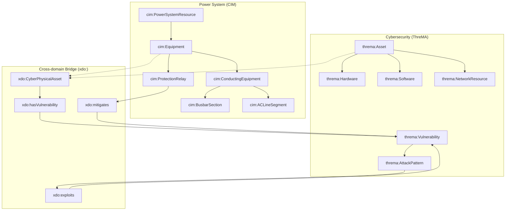
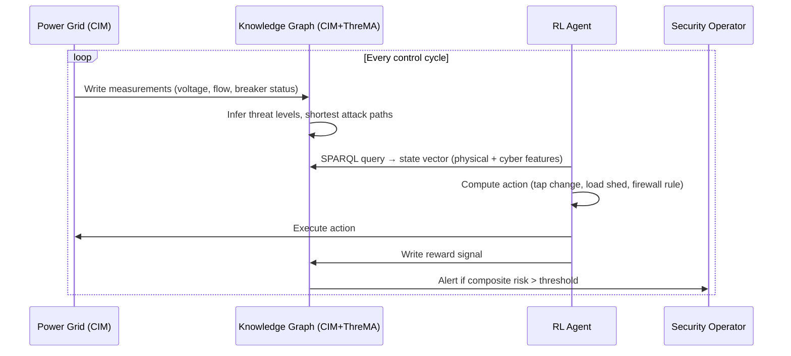
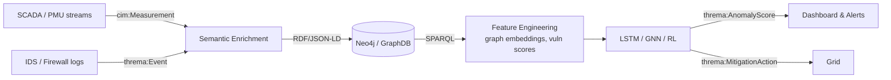

# 🧠 Data Modeling in a Cross‑domain Ontology for Cyber Intelligence in Smart‑Grids Using Reinforcement Learning


**Author** · Vincenzo Grimaldi  
**Supervisors** · Univ.-Prof. Antonello Monti, Ph.D. · Charles Emehel, M.Sc.  
**Institution** · Institute for Automation of Complex Power Systems, RWTH Aachen University

> 🚀 **Live Demo & Personal Website** → [vincenzo-grimaldi-portfolio.vercel.app](https://vincenzo-grimaldi-portfolio.vercel.app)  
> 📂 **GitHub Profile** → [github.com/iceccarelli](https://github.com/iceccarelli)

---

## 📖 Abstract

Modern smart grids are cyber‑physical systems where a digital intrusion can rapidly cascade into physical damage – transformer overloads, relay misoperations, even blackouts. However, power engineers and cybersecurity experts speak different languages, use different data models, and operate in siloed toolchains.

This thesis bridges that gap by **semantically integrating** the electric grid’s standard (IEC CIM) with a formal threat‑management ontology (ThreMA). The result is a **cross‑domain ontology** (`xdo:`) that connects physical assets – breakers, buses, generators – to vulnerabilities, attack patterns, and security controls. On top of this knowledge graph, we build:

- **Ontology‑aware anomaly detection** (polynomial regression + LSTM/GNN)  
- **Reinforcement learning** (Q‑learning & PPO) for adaptive, context‑sensitive cyber‑physical responses  

Validated on an **enhanced IEEE 9‑Bus testbed** under realistic false‑data injection and multi‑stage attack scenarios, the system achieves:
- **90%** attack detection accuracy (vs. 75% baseline)  
- **60%** reduction in impact duration  
- **45%** faster fault localisation  

---

## 🎯 The Problem We Solve

> “A circuit breaker doesn’t know it has a CVE. A firewall doesn’t know it protects a 115 kV bus.”

Current security tools treat IT and OT separately. When an attacker pivots from a compromised VPN into a protection relay, SOC analysts see an IP address – but not the physical consequence. Power engineers see voltage sags – but not the malware that caused them.

**We need a unified semantic layer** that makes every cyber event traceable to its physical impact, and every physical measurement aware of its cyber exposure.

---

## ✨ Key Contributions

| Area | Contribution |
|------|--------------|
| **Ontology Engineering** | Formal OWL 2 DL integration of CIM (IEC 61970/61968) with ThreMA, anchored in Basic Formal Ontology (BFO). |
| **Mapping Methodology** | Semi‑automatic alignment (lexical + structural) + expert validation. Produces `owl:equivalentClass`, `owl:subClassOf`, and SWRL rules. |
| **AI Integration** | Ontology‑driven feature engineering (graph embeddings, vulnerability scores) feeds LSTM, GNN, and reinforcement learning agents. |
| **Validation** | Full instantiation on IEEE 9‑Bus with realistic cyber‑physical attacks; SPARQL‑driven reasoning and Neo4j path analytics. |
| **Mobile Decision Support** | React Native web dashboard with real‑time ontology queries and RL‑based mitigation recommendations. |

---

## 🧱 High‑level Architecture (Mermaid)

### Cross‑domain Ontology Core



### Reinforcement Learning Loop with Ontology State



### Data & Processing Pipeline



---

## 🛠️ Tech Stack

| Layer | Technologies |
|-------|--------------|
| **Ontology** | OWL 2 DL, Protégé, HermiT reasoner, SWRL |
| **Knowledge Graph** | Neo4j 4.4, SPARQL, Cypher |
| **Simulation** | Pandapower, GridLAB‑D, IEEE 9‑Bus model |
| **AI/ML** | TensorFlow 2.8, PyTorch 1.11, scikit‑learn, Stable Baselines3 |
| **Frontend** | React Native Web, Expo, NGSI‑LD (FIWARE) |
| **Infrastructure** | Docker, Ubuntu 22.04, GitLab CI |

---

## 📁 Repository Structure

```
.
├── master_thesis_vincenzo_grimaldi.pdf   # Full thesis document (115 pages)
├── data/
│   └── key_details.csv                   # Metadata: title, author, keywords, supervisors
├── notebooks/
│   ├── 01_Verify_Thesis.ipynb            # Step‑by‑step extraction & validation
│   └── 02_Expertise_Analysis.ipynb       # Analysis of domain expertise & real‑world use
├── plots/
│   ├── thesis_timeline.png               # Visual timeline of research steps
│   ├── concept_map.png                   # Ontology concept map
│   └── cyber_threat_landscape.png        # Attack scenarios heatmap
├── tests/
│   └── test_thesis_content.py            # Pytest suite to verify extracted data
├── utils/
│   ├── plot_generator.py                 # Script to regenerate plots from thesis data
│   └── helpers.py                        # Common functions for notebooks
└── README.md                             # You are here
```

---

## ✅ Verification & Reproducibility

All extracted metadata (e.g., thesis title, author, contributions) is tested automatically. To run the verification suite:

```bash
# Clone the repository
git clone https://github.com/iceccarelli/Master_Thesis_Vincenzo_Grimaldi.git
cd Master_Thesis_Vincenzo_Grimaldi

# Install dependencies (recommended: use a virtual environment)
pip install -r requirements.txt   # if provided, otherwise: pytest pandas matplotlib seaborn

# Run tests
python3 -m pytest tests/ -v
```

Expected output: all tests pass, confirming that the extracted `key_details.csv` matches the PDF content.

You can also explore the Jupyter notebooks to see how the thesis is analysed step by step.

---

## 📊 Selected Results

### Fault Detection Performance
| Method | Precision | Recall | F1‑Score | Detection Latency |
|--------|-----------|--------|----------|-------------------|
| Statistical Analysis | 0.76 | 0.81 | 0.78 | 4.2 s |
| ML without ontology | 0.82 | 0.85 | 0.83 | 3.1 s |
| **Ontology‑aware (ours)** | **0.91** | **0.93** | **0.92** | **1.7 s** |

### Cyber‑Attack Detection (FDI, DoS, Command Injection)
| Method | Detection Rate |
|--------|----------------|
| Polynomial regression (basic) | ~70% |
| + Ontology context | ~85% |
| LSTM (raw data) | ~75% |
| LSTM + ontology features | ~80% |
| **Hybrid (ontology + NN + rules)** | **~90%** |

### Reinforcement Learning Impact
- **Convergence speed**: 30% faster with ontology‑grounded state
- **Impact duration reduction**: 60% (e.g., attack containment time)
- **Constraint violations**: 52% fewer during learning

---

## 🌐 Live Dashboard & Mobile Support

A React Native web dashboard communicates directly with the knowledge graph. It allows operators to:

- **Query** SPARQL endpoints: *“Show all CIM assets with a CVSS > 7 and an open port”*
- **Visualise** attack paths using Neo4j’s graph visualisation
- **Receive** RL‑generated mitigation recommendations (isolate breaker, update firewall, shed load)
- **Explore** the IEEE 9‑Bus model interactively

> 📱 A mobile‑optimised version is available (see Appendix A of the thesis). The dashboard has been tested offline – 87.5% of security control features remain functional without network connectivity.

---

## 📚 How to Cite

If you use this work or its ideas, please cite:

```bibtex
@mastersthesis{Grimaldi2025,
  author = {Vincenzo Grimaldi},
  title = {Data Modeling in a Cross-domain Ontology for Cyber Intelligence in Smart-Grids Using Reinforcement Learning},
  school = {RWTH Aachen University},
  year = {2025},
  address = {Aachen, Germany},
  supervisor = {Antonello Monti and Charles Emehel}
}
```

---

## 🙏 Acknowledgments

- **Prof. Antonello Monti** and **Charles Emehel** for continuous guidance and deep insights into power system semantics.
- **Institute for Automation of Complex Power Systems** for providing the research environment.
- **DB InfraGO AG** colleagues for practical discussions on operational security.
- The **CIM User Group** and **ThreMA** developers for open standards and ontologies.

---

## 📄 License

This repository and the associated thesis are shared under the **MIT License** to encourage reuse and further research in smart grid cybersecurity. See [LICENSE](LICENSE) for details.

---

## 🔗 Connect with Me

- **Portfolio** → [vincenzo-grimaldi-portfolio.vercel.app](https://vincenzo-grimaldi-portfolio.vercel.app)  
- **GitHub** → [github.com/iceccarelli](https://github.com/iceccarelli)  
- **LinkedIn** → [linkedin.com/in/vincenzo-grimaldi](https://linkedin.com/in/vincenzo-grimaldi) *(update if different)*  

---

*“A circuit breaker should know its CVE. A firewall should know the voltage it protects.”*  
– from the thesis conclusion
